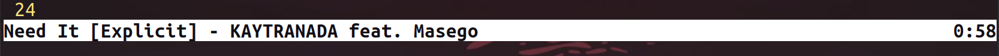

## vimedia                                                                           
Control your media players from inside Vim, if you're really
that lazy

In addition to displaying track/artist information in your statusline, you can also navigate 
through your media libraries, control volume, etc. using the following commands.

## Usage
- `:Play`            => Begin playback from active media player
- `:Pause`           => Pause playback from active media player
- `:PauseAll`        => Pause playback from all running media players
- `:Skip`            => Skip to next song
- `:Prev`            => Go back to previous song
- `:Seek {duration}` => Seek forward/backward `x` seconds
- `:Restart`         => Seek to beginning of current track
- `:Shuffle`         => Toggle shuffle for the media player
- `:Mute`            => Mute audio for all media players
- `:Unmute`          => Unmute audio for all media players
- `:Vol`             => Toggle volume louder/quieter
- `:Quit`            => Send quit signal to active media player
- `:ActivePlayer`    => Confirm active media player
- `:SelectPlayer`    => Select/change active media player from list of all running options

Please keep in mind that individual media players are responsible for implementing 
MPRIS properly/at all so available functionality can vary. At some point I will go 
through and properly add debug messages where functionality is not supported, but 
for now I've just tried to cover those places that throw errors when unavailable.

Rhythmbox is an example of a fully-implemented player, while a player like chromium 
is still very limited in terms of supported functionality.

For players that support the `Seek` command, `Prev` will return to the previous
track regardless of the position of the current track. If `Seek` is not
supported, `Prev` will only return to the previous track if the command is
called within the first few seconds of playback, otherwise it will restart
the current track (default MPRIS behavior).

## Config
To configure a default media player, add a line like the following to your
vimrc dotfile:

`let g:vimedia_default_player = "rhythmbox"`

If you're unsure of the name to set here, try opening the media player and running `:SelectPlayer` 
from within Vim to get a list of options (remember the players need to be running/active to detect).

By default the statusline is enabled and will show playback metadata when
available, but you can disable the statusline in the following way:

`let g:vimedia_statusline_enabled = 0`

## Contributions
Suggestions/contributions welcome.

## Installation
Using your preferred plugin manager or if all else fails:

`git clone https://github.com/alyosha/vimedia ~/.vim/bundle/vimedia`
